# almost-no-markdown-vault
A distraction-free Obsidian vault that disables most Markdown formatting using a custom plugin and CSS snippet.

Clean. Calm. Controlled.
*A distraction-free Obsidian vault that disables most Markdown styling and formatting triggers — so your writing stays raw, plain, and predictable.*

🧩 Finally type passwords, serial keys, and config strings without fear — no auto-formatting, no lost characters, no unwanted rendering.

📁 Includes Joplin-style sidebar navigation using the Notebook Navigator plugin, giving you a familiar folder-based workflow.


<br>
<br>


👉 **Get it on Gumroad 
Intro price - $20 one-time
Includes lifetime access to any future updates:**  
🎯 [Buy the Almost No Markdown Vault →](https://nomarkdown.gumroad.com/l/vault)


<br>
<br>

🔍 What This Vault Does

The Almost No Markdown Vault disables most visible Markdown formatting, including:

Bold (**bold**)

Italic (*italic*)

Inline code (`code`)

Code blocks (``` or ~~~)

Headings (# Heading)

Horizontal rules (---, ***)

Blockquotes (> quote)

Internal links ([[link]])

Numbered and bulleted lists (1., - item)

Checklists (- [ ])

Superscript (^text)

Inline math ($math$)

HTML tags (`<b>, <div>, etc.`)

Hidden formatting triggered by the Tab key


This lets you type freely without fear of your text changing appearance, activating styling, or triggering invisible formatting behaviors.


<br>
<br>


✅ What Still Works

   Markdown still functions behind the scenes — your notes remain portable and markdown-valid.

   [[Internal links]], superscripts (^word), and math blocks ($math$) remain functional in the backend — just without any visual styling.

   Files and folders work exactly as in a normal vault.
   You can revert at any time by disabling the plugin and snippet.


<br>
<br>


📁 Joplin-Like Navigation

If you're coming from Joplin, you'll feel right at home.

Thanks to the built-in Notebook Navigator plugin (already enabled in this vault), your folder and note layout closely mirrors Joplin’s familiar structure:

Folders (notebooks) are always visible in the left sidebar.
Notes appear in a central list when clicking a folder.
Note contents open in the main editing pane.

This setup creates a clean, three-pane experience — just like Joplin — without the clutter of backlinks, tags, and popups. It's perfect for those who prefer structured notebooks over Obsidian's default graph/tag-centric layout.


<br>
<br>


### 📸 Markdown Comparison – Before vs After

| Markdown Feature         | Default Vault                       | Almost No Markdown Vault            |
| ------------------------ | ----------------------------------- | ----------------------------------- |
| Bold                     |           |           |
| Italic                   |         |         |
| Strikethrough            |  | 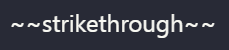 |
| Inline Code              | 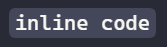    | 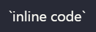    |
| Code Block               | 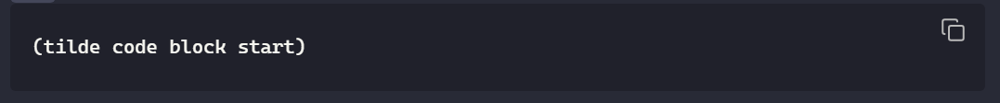     | 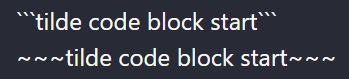     |
| Heading                  |        |        |
| Horizontal Rule          |     | 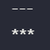    |
| Blockquote               |     |     |
| Internal Link            | 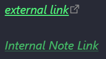         |           |
| Numbered List            | 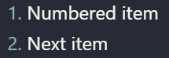      |       |
| Bullet List              | 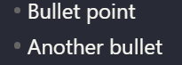        |         |
| Checklist                |      | 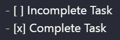     |
| Superscript              | 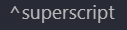   |    |
| Math                     |           |           |
| HTML Tags                |           | 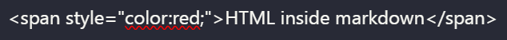          |
| Tab-triggered Formatting |            |            |


<br>
<br>


## 🚧 What Still Works (Unintentionally)

While this vault disables nearly all visible Markdown formatting, three formatting behaviors remain due to current technical limitations:
1. [[Internal Links]]

    Typing `[[` will still show a dropdown suggestion and link to the note.

    The dropdown can be hidden via CSS, but pressing Enter will still open the note.

    ✅ You can still use `[[` as plain text manually, just avoid pressing Enter.

2. > (Blockquotes)

    Typing > at the start of a line still creates a quote block.

    Formatting appears visually suppressed, but behavior remains under the hood.

    Workaround: You can prefix with another character (e.g. * > quote) to prevent quote parsing.

3. # Heading Syntax

    Typing # Title will still apply internal header block formatting.

    While the styling is visually removed, Obsidian will still treat it as a heading.

    For now, treat # like a special character — it won’t look like a heading, but it still behaves like one (e.g. appears in the outline panel).

<br>

📘 Want to see what Markdown normally does in Obsidian? [View full Markdown behavior examples →](/_assets/Markdown-Reference.md)

<br>
<br>

🔧 How It Works

This vault uses:

A custom Obsidian plugin (main.js) to override parts of the Markdown tokenizer and disable trigger keys.

A CSS snippet (disable-inline-formatting.css) to visually suppress most formatting styles.

⚠️ Note: The Tab key is intentionally disabled in this vault to prevent it from activating hidden formatting behaviors like code blocks.


<br>
<br>


📦 Installation

See [[Setup Instructions.txt]] for full setup steps, including:

How to install Obsidian (if new)
How to open this vault or switch from another
How to import your existing notes into this vault


<br>
<br>


💡 Ideal For...

   Writers who want zero formatting distractions
   Joplin users switching to Obsidian
   Plaintext minimalists
   Technical users tired of accidental styling


<br>
<br>


❓ FAQ

Q: Can I still use Markdown syntax?
Yes — all Markdown is preserved in your files. It just won’t render with formatting while using this vault.

Q: Will this affect other Obsidian vaults?
No. This setup is 100% self-contained. It won't change anything outside this vault.

Q: Can I undo this later?
Yes — you can remove the plugin and CSS snippet at any time to return to full Markdown rendering.


<br>
<br>


🛒 Get the Vault

Grab the vault here:
👉 nomarkdown.gumroad.com/l/vault
[nomarkdown.gumroad.com/l/vault](https://nomarkdown.gumroad.com/l/vault)  


<br>
<br>


📬 Support

Contact: nomarkdown@outlook.com


